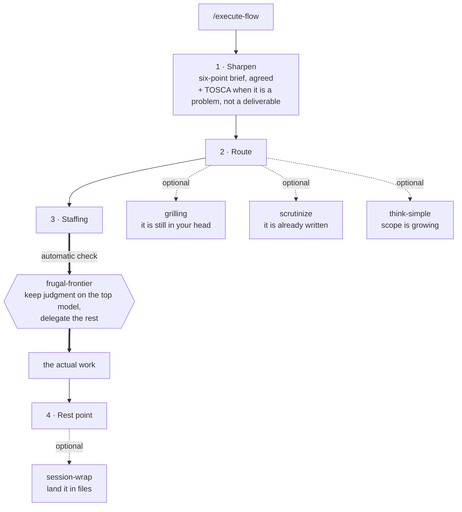

# claude-workflows

A toolbox for working better and more effectively with Claude Code. Eight
skills that make a work session predictable: sharpen the brief before anything
is built, pick the flow that fits, put the right model tier on it, and land the
session in files instead of losing it in the chat log.

Deliberately small. Every skill earns its place by covering a moment you will
recognise from your own sessions, and each one works on its own — install the
plugin and nothing else is required.

## The arc of a session



Start with `/execute-flow`; type `/ask-flow` first when you are not sure
which skill fits. An empty Route phase is the normal case, not a gap. The map
below lists all eight skills, how each is invoked, and where it attaches to
the arc — including `/tournament`, which `execute-flow` can name as a route
but never start: you type it yourself.

## The map

| Skill | Invocation | Reached from |
| --- | --- | --- |
| `execute-flow` | `/execute-flow` (user-invoked) | entry point — the spine itself |
| `ask-flow` | `/ask-flow` (user-invoked) | entry point — router over the other seven |
| `grilling` | model-invoked (or say "grill me") | Route — the plan is still in your head |
| `scrutinize` | model-invoked (or say "tear this apart") | Route — something is already written |
| `think-simple` | model-invoked (or say "MVP") | Route — scope is growing, not shipping |
| `frugal-frontier` | model-invoked | Staffing — not a station: an automatic check on top-tier models |
| `session-wrap` | model-invoked (or say "wrap") | Rest point — land it in files |
| `tournament` | `/tournament` (user-invoked) | Outside the arc — always typed directly |

All skills are written in English.

## What each skill buys you

### `/execute-flow` — the spine
**Buys you:** the four phases that keep a session from wandering — sharpen,
route, staff, rest point. Most wasted sessions are unsharp briefs, not weak
models, and phase 1 is the cheapest place to fix that.
**Reach for it when:** you sit down to work. Type it first, before describing
the task in detail.

### `/ask-flow` — the router
**Buys you:** an answer to "which of these fits what I'm doing right now",
without having to remember the set.
**Reach for it when:** you know something here applies but not which.

### `grilling` — interrogate the thinking
**Buys you:** one question at a time, each with a recommended answer, down every
branch of the decision tree — and nothing gets acted on until the understanding
is shared.
**Reach for it when:** the plan is still in your head and you can feel it is
half-formed. Say "grill me".

### `scrutinize` — attack the artefact
**Buys you:** four passes over something already written — steelman, verify the
load-bearing assumptions, multi-lens attack, referee report — ending on a
verdict it earned: sound, salvageable, or unsound.
**Reach for it when:** a draft, concept or prompt is on the table and you want
it broken before someone else breaks it. Say "tear this apart". The split from
`grilling`: that one interrogates *you*, this one works on *what is written*.

### `think-simple` — cut to what ships
**Buys you:** one done-sentence and the smallest version that satisfies it
today; everything struck lands on a parking list instead of quietly expanding
the job.
**Reach for it when:** options and research keep growing while the task itself
sits untouched. Say "MVP" or "keep it simple".

### `/tournament` — competing drafts, one best version
**Buys you:** a funnel in rounds from a rough idea to a best draft — competing
variants from disjoint lenses, scoring against a yardstick you approved, your
redline deciding winner, grafts and kills, convergence until a dry round. Every
round lands as a version file with a cumulative graveyard, so no killed idea
silently returns.
**Reach for it when:** the outcome is a concept, design or document worth more
than one attempt — anything where the first draft anchoring too early is the
real risk. `execute-flow` names it as a switch route but cannot start it — you
type it yourself, which is also why it stays out of the session arc above.

### `session-wrap` — land it in files
**Buys you:** an evidence-checked backlog sync, the promises made during the
session collected out of the transcript, and a handover — so the next session
starts fresh instead of inheriting a tired context window.
**Reach for it when:** a result is filed, the context is switching, or your own
answers start repeating what is already known. Say "wrap".

### `frugal-frontier` — delegation economics
**Buys you:** the top model kept on judgment while heavy, verifiable work fans
out to cheaper tiers, with results coming back through files instead of context
windows.
**Reach for it when:** you are on the installation's strongest model and the
work is token-heavy. One hard rule: never together with Ultracode — one orders
maximum effort, the other conserves.

## Companion skills (optional)

`execute-flow` is a router, so it names the skills that do a step best. Each
route carries a short form of the procedure right next to the name, so a route
whose skill you don't have still executes — it just loses the shortcut. If you
do have these installed, `execute-flow` will hand off to them:

| Named in | Capability it accelerates |
| --- | --- |
| `research` | Background agent that reads primary sources and files one cited Markdown file |
| `prototype` | Throwaway code that answers exactly one design question |
| `/wayfinder` | Charting work too big for one session as a map of decision tickets |
| `/entscheidungsvorlage` | Turning an idea into a one-pager a named decider can say yes or no to |
| `/writing-great-skills` | Writing or reworking a skill |

These are not vendored here — nothing in this repo depends on them, and there
is no attempt to reproduce them.

## Installation

As a plugin, in an interactive `claude` session:

```
/plugin marketplace add ab-123456-cloud/claude-workflows
/plugin install flow-skills@flow-skills
```

Update later with `/plugin marketplace update flow-skills`.

Or plain copy: drop any skill folder into `~/.claude/skills/`.

## Structure

```
.claude-plugin/marketplace.json      marketplace manifest (lists the plugins)
plugins/flow-skills/
  .claude-plugin/plugin.json         plugin manifest
  skills/<name>/SKILL.md             one folder per skill
```

## Adding a skill

1. Copy the skill folder to `plugins/flow-skills/skills/<name>/` (at least `SKILL.md`).
2. Give it a section above — what it buys you, and when to reach for it.
3. Bump `version` in both manifests, commit, push.
4. Locally: `/plugin marketplace update flow-skills`.

Eval fixtures and test data stay out — they belong in the development copy,
not in the distribution.

## License & credits

MIT — see [LICENSE](LICENSE). `frugal-frontier` is adapted from
[BuilderIO/skills](https://github.com/BuilderIO/skills) (`efficient-fable`,
MIT), extended with explicit model tiers, a conservative build-quality floor,
a file-based context firewall, harness selection, and a budget-capped research
workflow. `grilling` is adapted from
[mattpocock/skills](https://github.com/mattpocock/skills) (`grilling`, MIT);
this fork deliberately keeps the one-question-at-a-time interview — upstream
has since moved to batched question rounds — matching `execute-flow`'s
phase-1 rule.
